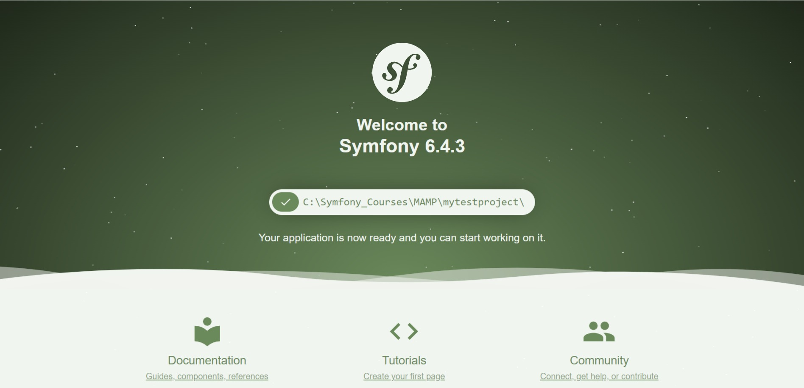

# Environnement De Developpement : PHP

+ **PHP** : version récente (version 8.2 au minimum)
+ **Commander** : terminal complet un peu plus simple (Windows/MAC)
+ **Composer** : Installation de Packages (exemple : symphony)
+ **MAMP & MAMP PRO** : livre un certain nombre de fonctionnalité (composants : Mysql, Apache, PHP ...)

# IDE(Editeur De Code Intelligent) PHP : aux choix


+ **PhpStorm** : payant (30 jours d'essai gratuit)
+ **VS Code** : gratuit

# Liens de téléchargement / Guide De Documentation De Symfony

+ [Documentation De Reférence](https://symfony.com/doc/current/setup.html#running-symfony-applications)

| Outils          | Liens de référence                                               |
|-----------------|------------------------------------------------------------------|
| PhpStorm        | https://www.jetbrains.com/phpstorm/download/download-thanks.html |
| MAMP & MAMP PRO | https://www.mamp.info/en/downloads/                              |
| Composer        | https://getcomposer.org/download/                                |
| Cmder           | https://cmder.app/                                               |
| Symfony CLI     | https://symfony.com/download                                     |

# Installation de Composer en ligne de commande

```
php -r "copy('https://getcomposer.org/installer', 'composer-setup.php');"
php -r "if (hash_file('sha384', 'composer-setup.php') === 'e21205b207c3ff031906575712edab6f13eb0b361f2085f1f1237b7126d785e826a450292b6cfd1d64d92e6563bbde02') { echo 'Installer verified'; } else { echo 'Installer corrupt'; unlink('composer-setup.php'); } echo PHP_EOL;"

php composer-setup.php

php -r "unlink('composer-setup.php');"

php composer.phar
```


# Installion Symfony CLI En Détail: Windows Powershell

```
Set-ExecutionPolicy -ExecutionPolicy RemoteSigned -Scope CurrentUser
scoop install symfony-cli
symfony -V
symfony
symfony update symfony-cli
```

# Creation Projet 1 : mytestproject

```
symfony new mytestproject --webapp
```

# Structure de repertoire par défaut de Symfony


```
your_project/
├─ assets/
├─ bin/
│  └─ console
├─ config/
│  ├─ packages/
│  └─ services.yaml
├─ migrations/
├─ public/
│  ├─ build/
│  └─ index.php
├─ src/
│  ├─ Kernel.php
│  ├─ Command/
│  ├─ Controller/
│  ├─ DataFixtures/
│  ├─ Entity/
│  ├─ EventSubscriber/
│  ├─ Form/
│  ├─ Repository/
│  ├─ Security/
│  └─ Twig/
├─ templates/
├─ tests/
├─ translations/
├─ var/
│  ├─ cache/
│  └─ log/
└─ vendor/
```

# Détail Et Description Structure de repertoire par défaut de Symfony : ChatGPT

+ **L'architecture de Symfony suit le modèle de conception MVC (Modèle-Vue-Contrôleur) et est basée sur une structure de répertoires organisée et des composants modulaires. Voici une description détaillée des principaux composants de l'architecture Symfony :**

    + **Répertoire `app/`** :

        + `config/` : Contient des fichiers de configuration pour l'application, tels que la configuration de routage, de services et d'autres paramètres.
        + `resources/` : Contient des fichiers de configuration et des modèles.
        + `var/` : Stocke des fichiers temporaires, des journaux et le cache.

    <br/>
  
    + **Répertoire `src/`** : Il s'agit de l'emplacement du code source de l'application.

      + `Controller/` : Les contrôleurs gèrent les demandes des utilisateurs et orchestrent la logique de l'application.
      + `Entity/` : Contient les entités Doctrine représentant les tables de la base de données.
      + `Form/` : Classes de formulaire pour créer et traiter les formulaires HTML.
      + `Repository/` : Répertoire des dépôts personnalisés pour les requêtes de base de données.
      + `Service/` : Services personnalisés utilisés dans toute l'application.
      + `EventSubscriber/` : Classes qui s'abonnent aux événements à l'aide du système d'événements de Symfony.

    <br/>
  
    + **Répertoire `templates/` :**

        + Modèles `Twig` pour le rendu des vues.
    <br/>
      
    + **Répertoire `public/` :**

        + Fichiers accessibles publiquement, tels que les ressources (CSS, JavaScript, images).
        + Le fichier index.php est le point d'entrée pour toutes les requêtes.

    + **Répertoire `bin/` :**

        + Commandes console et scripts.
        + Le script console pour exécuter les commandes console Symfony.

    + **Répertoire `var/` :**

        + Fichiers temporaires, journaux et cache.
        + Le répertoire `cache/` stocke les fichiers mis en cache.
        + Le répertoire `logs/` contient les journaux de l'application.
        + Le répertoire `sessions/` stocke les fichiers de session.

    + **Répertoire `vendor/` :**

        + Dépendances installées via `Composer`.
      
    + **Répertoire `config/` :**

        + Fichiers de configuration pour différents environnements (dev, prod, test).
        + Le répertoire `packages/` contient des fichiers de configuration pour les bundles.

    + **Répertoire `bin/` :**

        + Scripts exécutables pour l'application, y compris le script console pour exécuter les commandes console Symfony.

    + **Répertoire `tests/` :**

        + Tests unitaires et fonctionnels pour l'application.

    + **Répertoire `translations/` :**

        + Fichiers de traduction pour l'internationalisation.
    
    + Fichiers `.env` et `.env.local` :

        + Fichiers de configuration d'environnement contenant des variables telles que les détails de la connexion à la base de données, les clés API, etc.

+ L'architecture de Symfony suit les principes de l'injection de dépendances et utilise un conteneur de services pour gérer les services et les dépendances. Le fichier `services.yaml` dans le répertoire `config/` définit les services et leurs configurations.

+ Cette structure offre une séparation claire des responsabilités et encourage la modularité, facilitant la maintenance et l'évolutivité des applications Symfony. La flexibilité de Symfony permet aux développeurs d'adapter l'architecture en fonction des besoins spécifiques de leurs projets.


# Lancement Symfony

+ **Log**

```
symphony server:start
symphony server:log
```

+ **Sans Log**

```
symphony server:start -d
```

# Page Par Defaut



# Creation Projet 2: laboubiquefrancaise

```
symphony new laboutiquefrancaise --webapp
```

# Les membres

+ Il y a un aspect lié à la sécurité, car il est question de stcoker les informations des utilisateurs à la base de données.
+ Les différentes de créations dans cette partie : 

    + **Phase 1 :** Création de l'entité User();
    + **Phase 2 :** Création d'un formulaire d'inscription
    + **Phase 3 :** Création d'un formulaire de connexion
    + **Phase 4 :** Création d'un espace privé (membre)

